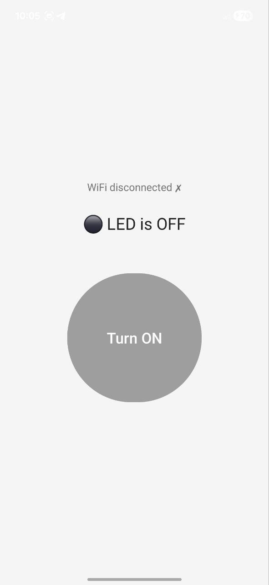

# ESP8266 LED Control App

An Android app to control the built-in blue LED on an ESP8266 over WiFi. The ESP8266 creates its own WiFi hotspot — no router needed.

---

## 📱 Features

- One-tap toggle to turn the ESP8266 built-in LED ON / OFF
- Shows live WiFi connection status
- Works without internet — direct ESP8266 hotspot connection
- Compatible with Android 9 and above

---

## 🖼 Screenshots & Images

### App UI
<p>
  
  &nbsp;&nbsp;&nbsp;
  
</p>
---

## 🛠 Requirements

### Hardware
- ESP8266 board (NodeMCU, Wemos D1 Mini, etc.)
- USB cable (for flashing)
- Android phone (Android 9+)

### Software
- [Arduino IDE](https://www.arduino.cc/en/software)
- ESP8266 board package installed in Arduino IDE
- Android Studio (to build the app)

---

## 📡 ESP8266 Setup

### 1. Install ESP8266 Board in Arduino IDE

1. Open Arduino IDE
2. Go to **File → Preferences**
3. In **Additional Board Manager URLs**, add:
   ```
   http://arduino.esp8266.com/stable/package_esp8266com_index.json
   ```
4. Go to **Tools → Board → Board Manager**
5. Search `ESP8266` and click **Install**

### 2. Flash the ESP8266

1. Open `esp8266_led.ino` in Arduino IDE
2. Select your board: **Tools → Board → NodeMCU 1.0** (or your board name)
3. Select the correct port: **Tools → Port → COMX**
4. Click **Upload**
5. Open **Serial Monitor** at `115200` baud — you should see:
   ```
   AP IP: 192.168.4.1
   Server ready
   ```

---

## 📂 Project Structure

```
ESP8266/
├── app/
│   └── src/
│       └── main/
│           ├── java/com/example/esp8266/
│           │   └── MainActivity.java
│           ├── res/
│           │   ├── layout/
│           │   │   └── activity_main.xml
│           │   └── mipmap-*/
│           │       └── ic_launcher.png
│           └── AndroidManifest.xml
└── esp8266/
    └── esp8266.ino
```

---

## 🚀 How to Use

1. **Power on** the ESP8266 (via USB or battery)
2. On your Android phone, go to **Settings → WiFi**
3. Connect to the network:
   - **SSID:** `ESP8266_LED`
   - **Password:** `12345678`
4. Open the app
5. Wait for **"WiFi connected ✓"** to appear
6. Tap the button to toggle the LED ON / OFF

---

## ⚙️ Configuration

To change the WiFi name or password, edit these lines in `esp8266_led.ino`:

```cpp
const char* ssid     = "ESP8266_LED";   // Change WiFi name here
const char* password = "12345678";      // Change password here (min 8 chars)
```

To change the ESP8266 IP address in the app, edit this line in `MainActivity.java`:

```java
private static final String ESP_IP = "http://192.168.4.1";
```

---

## 🔌 LED Pin Info

| Board        | Built-in LED Pin | Active |
|--------------|-----------------|--------|
| NodeMCU      | GPIO2 (D4)      | LOW    |
| Wemos D1 Mini| GPIO2           | LOW    |
| ESP-01       | GPIO1           | LOW    |

> The built-in LED is **active LOW** — sending `LOW` turns it ON, `HIGH` turns it OFF.

---

## 🐛 Troubleshooting

| Problem | Solution |
|--------|----------|
| "Cannot reach ESP8266" | Make sure `android:usesCleartextTraffic="true"` is in AndroidManifest.xml |
| App uses mobile data instead of WiFi | The `bindToWifiNetwork()` method forces WiFi — check it is present in MainActivity.java |
| LED does not respond | Open browser on phone and go to `http://192.168.4.1/on` to test ESP directly |
| Serial Monitor shows different IP | Update `ESP_IP` in MainActivity.java to match |
| Cannot connect to ESP WiFi | Make sure ESP is powered and flashed correctly; password must be 8+ characters |
| App crashes on launch | Check `INTERNET` permission is in AndroidManifest.xml |

---

## 🌐 API Endpoints

The ESP8266 web server exposes these endpoints:

| Endpoint | Action |
|----------|--------|
| `http://192.168.4.1/on` | Turn LED ON |
| `http://192.168.4.1/off` | Turn LED OFF |
| `http://192.168.4.1/status` | Get current LED state (`ON` or `OFF`) |

You can test these directly in your phone's browser while connected to the ESP WiFi.

---

## 🖼 App Icon

To set a custom app icon:

1. In Android Studio, right-click the `res` folder
2. Select **New → Image Asset**
3. Choose your image (PNG recommended, 1024×1024 px)
4. Click **Next → Finish**

---

## 📄 License

This project is open source and free to use for personal and educational purposes.
